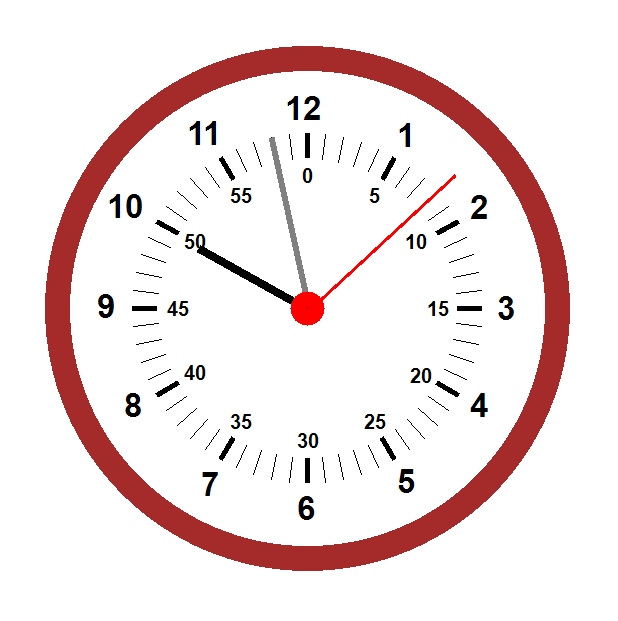

> **Language Notice**: 
> [View in Arabic (العربية)](README_AR.md) |

# Analog Clock - Windows Forms Application

 


This code is a C# implementation of an **analog clock** using Windows Forms. It creates a graphical representation of a clock with hour, minute, and second hands, along with hour and minute markings. Below is a detailed explanation of the code:

---
 
### **1. Namespace and Class**
```csharp
namespace ANALOG_CLOCK
{
    public partial class frmANALOG_CLOCK : Form
    {
        // Variables and methods
    }
}
```
- The code is part of the `ANALOG_CLOCK` namespace.
- The `frmANALOG_CLOCK` class inherits from `Form`, which is the base class for Windows Forms applications.

---

### **2. Variables**
```csharp
int SecondHand, MinuteHand, HourHand, Clk_Radius;
Point Clk_Center, PictureBox_Origin, Clock_Origin;
Graphics graphics;
Bitmap bitmap;
```
- **`SecondHand`, `MinuteHand`, `HourHand`**: Store the lengths of the clock hands.
- **`Clk_Radius`**: The radius of the clock.
- **`Clk_Center`**: The center point of the clock.
- **`PictureBox_Origin`**: The starting point of the `PictureBox` control (used to display the clock).
- **`Clock_Origin`**: The starting point of the clock within the `PictureBox`.
- **`graphics`**: A `Graphics` object used to draw on the `Bitmap`.
- **`bitmap`**: A `Bitmap` object that acts as the canvas for drawing the clock.

---

### **3. Form Load Event**
```csharp
private void frmANALOG_CLOCK_Load(object sStarter, EventArgs e)
{
    InitializeClock();
    timer1.Interval = 1000;
    timer1.Start();
}
```
- **`InitializeClock()`**: Initializes the clock's dimensions and properties.
- **`timer1.Interval = 1000`**: Sets the timer interval to 1 second (1000 milliseconds).
- **`timer1.Start()`**: Starts the timer, which triggers the `timer1_Tick` event every second.

---

### **4. Timer Tick Event**
```csharp
private void timer1_Tick(object sStarter, EventArgs e)
{
    graphics.Clear(Color.White);

    _DrawClock();
    _DrawHourNumbers();
    _DrawMinuteLines();
    _DrawMinuteNumbers();
    _DrawClockHands();
    Draw_Circle(8, new Pen(Color.Red, 18));

    pbClock.Image = bitmap;
}
```
- **`graphics.Clear(Color.White)`**: Clears the canvas with a white background.
- **`_DrawClock()`**: Draws the outer circle of the clock.
- **`_DrawHourNumbers()`**: Draws the hour numbers (1 to 12) around the clock.
- **`_DrawMinuteLines()`**: Draws the minute markings (small lines) around the clock.
- **`_DrawMinuteNumbers()`**: Draws the minute numbers (e.g., 5, 10, 15, etc.) around the clock.
- **`_DrawClockHands()`**: Draws the hour, minute, and second hands.
- **`Draw_Circle(8, new Pen(Color.Red, 18))`**: Draws a small red circle at the center of the clock.
- **`pbClock.Image = bitmap`**: Updates the `PictureBox` with the newly drawn clock.

---

### **5. Clock Initialization**
```csharp
void InitializeClock()
{
    Clk_Radius = 250;
    PictureBox_Origin = new Point(10, 10);
    pbClock.Location = PictureBox_Origin;
    pbClock.Width = 3 * Clk_Radius;
    pbClock.Height = 3 * Clk_Radius;

    Clock_Origin = new Point(pbClock.Location.X + (int)(Clk_Radius / 5), pbClock.Location.Y + (int)(Clk_Radius / 5));

    bitmap = new Bitmap((int)(2.5 * Clk_Radius), (int)(2.5 * Clk_Radius));
    graphics = Graphics.FromImage(bitmap);
    Clk_Center = new Point(bitmap.Width / 2, bitmap.Width / 2);
    SecondHand = (int)(Clk_Radius * 0.8);
    MinuteHand = (int)(Clk_Radius * 0.7);
    HourHand = (int)(Clk_Radius * 0.5);
}
```
- Sets the clock's radius and initializes the `PictureBox` dimensions.
- Calculates the center of the clock and the lengths of the hands relative to the radius.

---

### **6. Drawing the Clock**
```csharp
void _DrawClock()
{
    Pen pen = new Pen(Color.Brown, 25);
    Rectangle Rec = new Rectangle(Clock_Origin.X, Clock_Origin.Y, Clk_Radius * 2, Clk_Radius * 2);
    graphics.DrawArc(pen, Rec, 0, 360);
}
```
- Draws the outer circle of the clock using a brown pen.

---

### **7. Drawing the Clock Hands**
```csharp
void _DrawClockHands()
{
    double Second = DateTime.Now.Second;
    double Minute = DateTime.Now.Minute;
    double Hour = DateTime.Now.Hour;
    Hour += Minute / 60;
    double SecondAngle = Second * (360 / 60);
    SecondAngle += 270;
    Point SecondPoint = GetPoint(SecondAngle, SecondHand);
    graphics.DrawLine(new Pen(Color.Red, 3f), Clk_Center, SecondPoint);

    double MinuteAngle = Minute * (360 / 60);
    MinuteAngle += 270;
    Point MinutePoint = GetPoint(MinuteAngle, MinuteHand);
    graphics.DrawLine(new Pen(Color.Gray, 6f), Clk_Center, MinutePoint);

    double HourAngle = Hour * (360 / 12);
    HourAngle += 270;
    Point HourPoint = GetPoint(HourAngle, HourHand);
    graphics.DrawLine(new Pen(Color.Black, 8f), Clk_Center, HourPoint);
}
```
- Calculates the angles for the hour, minute, and second hands based on the current time.
- Uses the `GetPoint` method to determine the endpoint of each hand.
- Draws the hands using different colors and thicknesses.

---

### **8. Drawing Hour Numbers**
```csharp
private void _DrawHourNumbers()
{
    int HourNumbersRadius = 200;
    double Angle = 270;
    for (int i = 12; i > 0; i--)
    {
        Point P = GetPoint(Angle, HourNumbersRadius);
        // Adjust positions for each number
        graphics.DrawString(i.ToString(), font, solidbrush, P.X, P.Y, stringformat);
        Angle -= 30;
    }
}
```
- Draws the numbers 1 through 12 around the clock at 30-degree intervals.

---

### **9. Drawing Minute Lines and Numbers**
```csharp
private void _DrawMinuteLines()
{
    // Draws small lines for each minute
}

private void _DrawMinuteNumbers()
{
    // Draws numbers for every 5 minutes
}
```
- **`_DrawMinuteLines()`**: Draws 60 small lines around the clock, with thicker lines for every 5 minutes.
- **`_DrawMinuteNumbers()`**: Draws numbers (e.g., 5, 10, 15, etc.) at the appropriate positions.

---

### **10. Helper Methods**
```csharp
Point GetPoint(double Angle, int Radius)
{
    Point point = new Point(0, 0);
    point.X = Clock_Origin.X + Clk_Radius + (int)(Radius * Math.Cos(Math.PI * Angle / 180));
    point.Y = Clock_Origin.Y + Clk_Radius + (int)(Radius * Math.Sin(Math.PI * Angle / 180));
    return point;
}

void Draw_Circle(int Radius, Pen pen)
{
    Rectangle rect = new Rectangle(Clock_Origin.X + Clk_Radius - Radius, Clock_Origin.Y + Clk_Radius - Radius, Radius * 2, Radius * 2);
    graphics.DrawArc(pen, rect, 0, 360);
}
```
- **`GetPoint()`**: Converts an angle and radius into a point on the clock.
- **`Draw_Circle()`**: Draws a circle with a specified radius and pen.

---

### **Summary**
This program creates a functional analog clock using Windows Forms. It dynamically updates the clock hands every second and includes hour and minute markings. The `Graphics` class is used extensively to draw the clock components, and the `Timer` ensures the clock updates in real-time.
