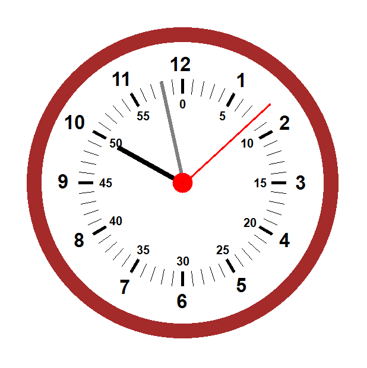

# ساعة تمثيلية - تطبيق Windows Forms

> **ملاحظة اللغة**: 
> [عرض باللغة الإنجليزية](README.md) |

 

هذا الكود هو تنفيذ بلغة C# لساعة تمثيلية باستخدام Windows Forms. ينشئ تمثيلاً بيانيًا لساعة مع عقارب للساعات والدقائق والثواني، بالإضافة إلى علامات للساعات والدقائق. فيما يلي شرح مفصل للكود:

---
### **1. مساحة الاسم والفئة**
```csharp
namespace ANALOG_CLOCK
{
    public partial class frmANALOG_CLOCK : Form
    {
        // المتغيرات والوظائف
    }
}
```
- الكود جزء من مساحة الاسم `ANALOG_CLOCK`.
- الفئة `frmANALOG_CLOCK` ترث من `Form`، وهي الفئة الأساسية لتطبيقات Windows Forms.

---

### **2. المتغيرات**
```csharp
int SecondHand, MinuteHand, HourHand, Clk_Radius;
Point Clk_Center, PictureBox_Origin, Clock_Origin;
Graphics graphics;
Bitmap bitmap;
```
- **`SecondHand`, `MinuteHand`, `HourHand`**: تخزن أطوال عقارب الساعة.
- **`Clk_Radius`**: نصف قطر الساعة.
- **`Clk_Center`**: النقطة المركزية للساعة.
- **`PictureBox_Origin`**: نقطة البداية لعنصر تحكم `PictureBox` (المستخدم لعرض الساعة).
- **`Clock_Origin`**: نقطة بداية الساعة داخل `PictureBox`.
- **`graphics`**: كائن `Graphics` يستخدم للرسم على `Bitmap`.
- **`bitmap`**: كائن `Bitmap` يعمل كقاعدة للرسم للساعة.

---

### **3. حدث تحميل النموذج**
```csharp
private void frmANALOG_CLOCK_Load(object sStarter, EventArgs e)
{
    InitializeClock();
    timer1.Interval = 1000;
    timer1.Start();
}
```
- **`InitializeClock()`**: يهيئ أبعاد وخصائص الساعة.
- **`timer1.Interval = 1000`**: يضبط الفاصل الزمني للمؤقت على ثانية واحدة (1000 ميلي ثانية).
- **`timer1.Start()`**: يبدأ المؤقت، مما يؤدي إلى تشغيل حدث `timer1_Tick` كل ثانية.

---

### **4. حدث المؤقت**
```csharp
private void timer1_Tick(object sStarter, EventArgs e)
{
    graphics.Clear(Color.White);

    _DrawClock();
    _DrawHourNumbers();
    _DrawMinuteLines();
    _DrawMinuteNumbers();
    _DrawClockHands();
    Draw_Circle(8, new Pen(Color.Red, 18));

    pbClock.Image = bitmap;
}
```
- **`graphics.Clear(Color.White)`**: يمسح القاعدة بخلفية بيضاء.
- **`_DrawClock()`**: يرسم الدائرة الخارجية للساعة.
- **`_DrawHourNumbers()`**: يرسم أرقام الساعة (1 إلى 12) حول الساعة.
- **`_DrawMinuteLines()`**: يرسم علامات الدقائق (خطوط صغيرة) حول الساعة.
- **`_DrawMinuteNumbers()`**: يرسم أرقام الدقائق (مثل 5، 10، 15، إلخ) حول الساعة.
- **`_DrawClockHands()`**: يرسم عقارب الساعة والدقائق والثواني.
- **`Draw_Circle(8, new Pen(Color.Red, 18))`**: يرسم دائرة حمراء صغيرة في مركز الساعة.
- **`pbClock.Image = bitmap`**: يحدث `PictureBox` بالساعة المرسومة حديثاً.

---

### **5. تهيئة الساعة**
```csharp
void InitializeClock()
{
    Clk_Radius = 250;
    PictureBox_Origin = new Point(10, 10);
    pbClock.Location = PictureBox_Origin;
    pbClock.Width = 3 * Clk_Radius;
    pbClock.Height = 3 * Clk_Radius;

    Clock_Origin = new Point(pbClock.Location.X + (int)(Clk_Radius / 5), pbClock.Location.Y + (int)(Clk_Radius / 5));

    bitmap = new Bitmap((int)(2.5 * Clk_Radius), (int)(2.5 * Clk_Radius));
    graphics = Graphics.FromImage(bitmap);
    Clk_Center = new Point(bitmap.Width / 2, bitmap.Width / 2);
    SecondHand = (int)(Clk_Radius * 0.8);
    MinuteHand = (int)(Clk_Radius * 0.7);
    HourHand = (int)(Clk_Radius * 0.5);
}
```
- يضبط نصف قطر الساعة ويهيئ أبعاد `PictureBox`.
- يحسب مركز الساعة وأطوال العقارب نسبة إلى نصف القطر.

---

### **6. رسم الساعة**
```csharp
void _DrawClock()
{
    Pen pen = new Pen(Color.Brown, 25);
    Rectangle Rec = new Rectangle(Clock_Origin.X, Clock_Origin.Y, Clk_Radius * 2, Clk_Radius * 2);
    graphics.DrawArc(pen, Rec, 0, 360);
}
```
- يرسم الدائرة الخارجية للساعة باستخدام قلم بني.

---

### **7. رسم عقارب الساعة**
```csharp
void _DrawClockHands()
{
    double Second = DateTime.Now.Second;
    double Minute = DateTime.Now.Minute;
    double Hour = DateTime.Now.Hour;
    Hour += Minute / 60;
    double SecondAngle = Second * (360 / 60);
    SecondAngle += 270;
    Point SecondPoint = GetPoint(SecondAngle, SecondHand);
    graphics.DrawLine(new Pen(Color.Red, 3f), Clk_Center, SecondPoint);

    double MinuteAngle = Minute * (360 / 60);
    MinuteAngle += 270;
    Point MinutePoint = GetPoint(MinuteAngle, MinuteHand);
    graphics.DrawLine(new Pen(Color.Gray, 6f), Clk_Center, MinutePoint);

    double HourAngle = Hour * (360 / 12);
    HourAngle += 270;
    Point HourPoint = GetPoint(HourAngle, HourHand);
    graphics.DrawLine(new Pen(Color.Black, 8f), Clk_Center, HourPoint);
}
```
- يحسب الزوايا لعقارب الساعة والدقائق والثواني بناءً على الوقت الحالي.
- يستخدم دالة `GetPoint` لتحديد نقطة نهاية كل عقرب.
- يرسم العقارب باستخدام ألوان وسماكات مختلفة.

---

### **8. رسم أرقام الساعات**
```csharp
private void _DrawHourNumbers()
{
    int HourNumbersRadius = 200;
    double Angle = 270;
    for (int i = 12; i > 0; i--)
    {
        Point P = GetPoint(Angle, HourNumbersRadius);
        // ضبط المواضع لكل رقم
        graphics.DrawString(i.ToString(), font, solidbrush, P.X, P.Y, stringformat);
        Angle -= 30;
    }
}
```
- يرسم الأرقام من 1 إلى 12 حول الساعة على فترات 30 درجة.

---

### **9. رسم خطوط وأرقام الدقائق**
```csharp
private void _DrawMinuteLines()
{
    // يرسم خطوطاً صغيرة لكل دقيقة
}

private void _DrawMinuteNumbers()
{
    // يرسم أرقاماً لكل 5 دقائق
}
```
- **`_DrawMinuteLines()`**: يرسم 60 خطاً صغيراً حول الساعة، بخطوط أكثر سماكة لكل 5 دقائق.
- **`_DrawMinuteNumbers()`**: يرسم أرقاماً (مثل 5، 10، 15، إلخ) في المواضع المناسبة.

---

### **10. وظائف مساعدة**
```csharp
Point GetPoint(double Angle, int Radius)
{
    Point point = new Point(0, 0);
    point.X = Clock_Origin.X + Clk_Radius + (int)(Radius * Math.Cos(Math.PI * Angle / 180));
    point.Y = Clock_Origin.Y + Clk_Radius + (int)(Radius * Math.Sin(Math.PI * Angle / 180));
    return point;
}

void Draw_Circle(int Radius, Pen pen)
{
    Rectangle rect = new Rectangle(Clock_Origin.X + Clk_Radius - Radius, Clock_Origin.Y + Clk_Radius - Radius, Radius * 2, Radius * 2);
    graphics.DrawArc(pen, rect, 0, 360);
}
```
- **`GetPoint()`**: يحول زاوية ونصف قطر إلى نقطة على الساعة.
- **`Draw_Circle()`**: يرسم دائرة بنصف قطر وقلم محددين.

---

### **الخلاصة**
ينشئ هذا البرنامج ساعة تمثيلية وظيفية باستخدام Windows Forms. يقوم بتحديث عقارب الساعة ديناميكياً كل ثانية ويتضمن علامات للساعات والدقائق. يتم استخدام فئة `Graphics` بشكل مكثف لرسم مكونات الساعة، ويضمن `Timer` تحديث الساعة في الوقت الفعلي.
